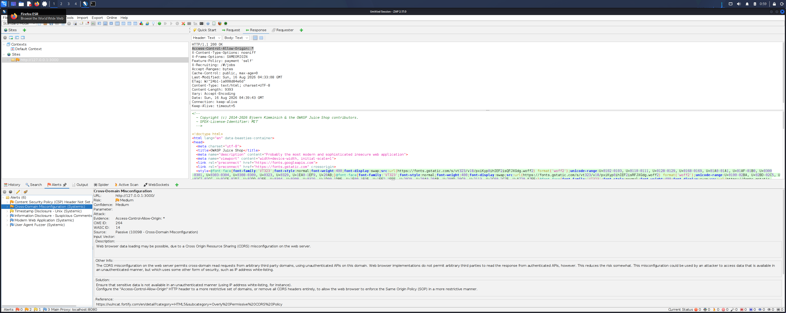
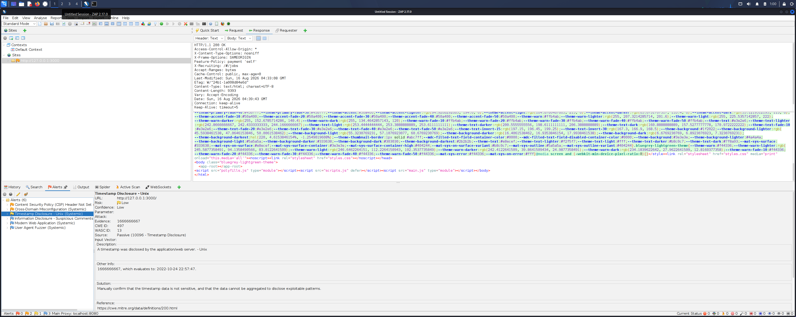
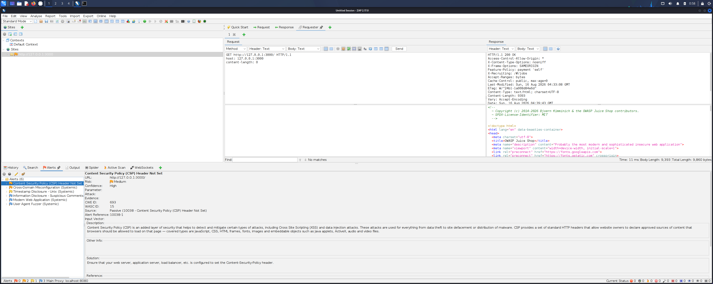
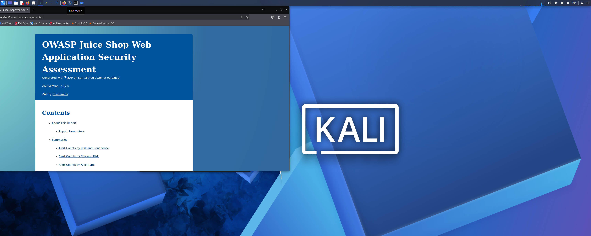

# Web Application Security Assessment with OWASP ZAP

## Overview

This project documents a controlled web application security assessment of **OWASP Juice Shop**, an intentionally vulnerable application, using **OWASP ZAP** in a Kali Linux lab environment.

The objective was to move beyond simply running an automated scanner by following a structured workflow: deploy the target, verify connectivity, discover application content, perform active vulnerability scanning, review individual findings, evaluate security impact, and document remediation guidance.

> **Scope:** All testing was performed against a locally hosted OWASP Juice Shop Docker container in an isolated lab environment.

## Lab Environment

- Kali Linux
- OWASP ZAP 2.17.0
- OWASP Juice Shop
- Docker
- Firefox
- VirtualBox
- Target: `http://127.0.0.1:3000`

## Assessment Methodology

1. **Target deployment and validation:** Deployed Juice Shop locally in Docker and verified connectivity.
2. **Application discovery:** Crawled the target with ZAP Spider to populate the site tree.
3. **Active vulnerability scan:** Tested the discovered application surface.
4. **Finding review:** Reviewed evidence, affected URLs, response headers, CWE/WASC references, risk, confidence, and remediation guidance.
5. **Reporting:** Generated and archived a formal ZAP HTML report with supporting screenshots.

## Scan Summary

| Severity | Alert Categories |
| --- | ---: |
| High | 0 |
| Medium | 2 |
| Low | 1 |
| Informational | 3 |

Observed categories included CSP Header Not Set, Cross-Domain Misconfiguration, Timestamp Disclosure, Information Disclosure, Modern Web Application, and User Agent Fuzzer.

The absence of a High-risk alert was not interpreted as proof that the application was secure.

## Key Findings

### 1. Content Security Policy Header Not Set

**Risk:** Medium  
**Confidence:** High  
**CWE:** 693  
**WASC:** 15

A missing CSP reduces browser-side defense-in-depth against client-side content injection. It does not by itself prove that exploitable XSS exists.

**Recommendation:** Define and test a restrictive CSP appropriate to the application's required resources.

### 2. Cross-Domain Misconfiguration

**Risk:** Medium  
**Confidence:** Medium  
**Evidence:** `Access-Control-Allow-Origin: *`

An overly permissive CORS configuration can allow untrusted origins to read resources intended for a restricted set of origins. Actual impact depends on the resource and authorization model.

**Recommendation:** Restrict allowed origins to explicitly trusted domains where cross-origin access is required.

### 3. Timestamp Disclosure

**Risk:** Low

Unix timestamp information was exposed in application responses. Although generally low risk, unnecessary metadata can contribute to reconnaissance.

## Scan Evidence

The archived report and supporting assets are available in the [`reports`](reports/) directory.

## Security Analysis

- Automated scanners identify potential weaknesses but require analyst interpretation.
- Risk ratings should be evaluated with evidence, confidence, affected resources, and application context.
- CSP provides defense-in-depth rather than proof of an underlying exploit.
- CORS should follow least-privilege principles.
- Low-risk disclosure can still contribute to reconnaissance.
- No High-risk scanner alerts does not establish that an application is secure.

## What I Learned

- **Automated scanning is the beginning of analysis, not the conclusion.** ZAP produced findings that still required validation of evidence, confidence, affected resources, and actual security impact.
- **A missing control is not automatically an exploitable vulnerability.** The missing CSP finding represented reduced defense-in-depth rather than proof that cross-site scripting was exploitable.
- **Risk depends on context.** A permissive CORS header can be important or relatively harmless depending on what the affected endpoint exposes and how authentication is handled.
- **Low-severity findings can still support attacker reconnaissance.** Metadata disclosures may have little standalone impact while still contributing useful environmental information.
- **A clean automated scan does not prove security.** Scanner coverage is limited to the application surface and techniques reached by the tool, so absence of High-risk alerts should not be overstated.

## Tools and Skills Demonstrated

- OWASP ZAP
- Dynamic Application Security Testing (DAST)
- Web application reconnaissance
- Spidering / content discovery
- Active vulnerability scanning
- HTTP request and response analysis
- Security header and CORS analysis
- CWE / WASC interpretation
- Vulnerability triage and risk analysis
- Remediation recommendations
- Docker and Kali Linux
- Technical security reporting

## Conclusion

This project demonstrates a repeatable web application assessment workflow using an intentionally vulnerable target in an isolated environment. The emphasis was not simply on generating scanner alerts, but on reviewing evidence, interpreting risk, and producing actionable remediation guidance.
